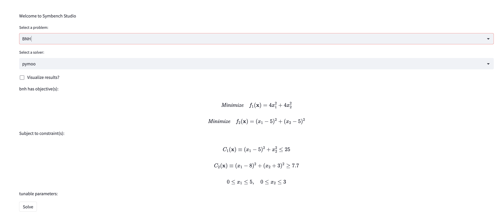

# symbench studio

Initial setup of symbench studio for interactive exploration of relevant optimization problems

# Usage

1. `cd symbench-studio && ./setup.sh`
2. `streamlit run app.py`

# TODO 
- [ ] modify solve parameters (e.g. population size, number of generations, etc. from user interface)
- [ ] write result to `symbench-studio-data`
- [ ] Select by specific problem (e.g. circle packing) instead of optimization problem type
- [ ] visualization after solve or view Pareto fronts of previous solves
- [ ] comparison of solver performance

